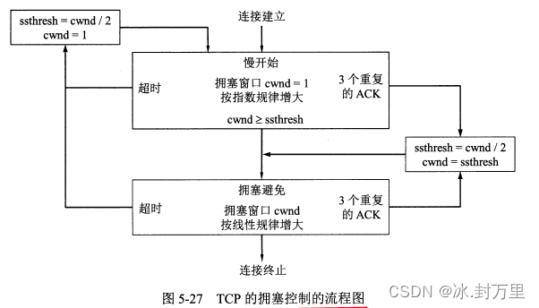

# 计算机网络
## 第一章 概述

#### 传播时延的计算&发送时延的计算
传播时延=信道长度(m) / 传播速率(m / s)
发送时延=数据帧长度(b)/发送速率(b / s)
发送速率也称速率、数据率、比特率
带宽是最高数据率，因此带宽指的是**发送速率**而不是传播速率
#### 传播时延、传输时延、处理时延的关系
传播时延：传播时延是电磁波在信道中传播一定的距离花费的时间，**与数据率和数据大小无关**

总时延 = 传播时延 ＋ 传输时延 + 处理时延 + 排队时延

分组交换时延 = 报文发送时间 + 传播时间 + 中间结点转发时间(注意分组交换时延中分组首部长度能否忽略不计)

电路交换时延 = 电路建立时延 + 传播时延 + 发送时延

时延带宽积 = 传播时延 * 带宽，又称为以比特为单位的链路长度，即某段链路(媒体)在某一时刻内的比特数

#### 网络协议的三要素
+ 语法，即数据与控制信息的结构或格式
+ 语义，即需要发出何种控制信息，完成何种动作以及做出何种响应
+ 同步，即事件实现顺序的详细说明
#### TCP/IP模型
运输层中主要使用的两个协议
+ 传输控制协议 **TCP**(Transmission Control Protocol)提供面向连接的、可靠的数据传输服务，其数据传输的单位是报文段
+ 用户数据报协议 **UDP** (User Datagram Protocol)提供无连接的尽最大努力的数据传输服务(不保证数据传输的可靠性)，其数据传输的单位是用户数据报
 
#### 互联网基础是APRAnet
#### OSI参考模型各层名称及功能
~~物联网实惠实用~~
+ 应**用**层 定义应用程序间通信和交互的规则
+ 表**示**层(略)
+ **会**话层(略)
+ 传**输**层 负责向两台主机中的进程之间的通信提供通用的数据传输服务
+ **网**络层 负责为分组交换网上的不同主机提供通信服务
发送数据时，网络层把运输层产生的报文段或用户数据报封装成分组或包进行传送。

    TCP/IP 体系中，网络层使用 IP 协议，因此分组也叫 IP 数据报，或简称数据报，但注意这与用户数据报不同。
+ 数据**链**路层 把网络层交下来的IP数据报组装成帧
+ **物**理层 比特流传输

#### N+1层和N层的关系
第n层的两个“实体(n)”之间通过“协议(n)层”进行通信
而第n+1层之间则通过另外的协议(n + 1)进行通信。

第n层向上面的第n+1层所提供的服务实际上已包括了在它以下各层所提供的服务。

使用本层服务的实体只能看见服务而无法看见下面的协议。
#### 协议数据单元、服务数据单元、服务与协议之间的关系
协议是控制两个对等实体间进行通信的规则的集合。

在协议的控制下，两个对等实体间的通信使得本层能够向上一层提供服务。要实现本层协议，也需要下一层提供的服务。
#### 计算机网络的分类
+ 广域网WAN：互联网的核心部分，连接广域网各结点的一般使高速链路。
+ 城域网MAN：很多城域网采用的是以太网技术，常并入局域网进行讨论
+ 局域网LAN：一般通过高速通信线路相连，地理范围较小。校园网、企业为一般为局域网
+ 个人区域网PAN：范围很小，一般在 10m 左右。
#### 往返时间RTT
发送时间= 数据长度 / 发送速率 ( 数据率 )

A 向 B 发数据后需要收到 B 发回的确认信息才会继续发送数据，A 发完数据后等待确认信息的时间就是往返时间（RTT）。

有效数据率 = 数据长度 / ( 发送时间 + RTT )
#### 利用率
利用率有信道利用率和网络利用率两种：

信道利用率：信道有百分之多少的时间是被利用的，即有数据通过。

网络利用率：全网络的信道利用率的加权平均值。
信道利用率并非越大越好，当利用率 U 达到 0.5 时，时延就要加倍。利用率接近 1 时，时延会趋于无穷。

D0 为网络空闲时的时延，则网络当前时延 D 和利用率 U 之间的关系为： D = D0 / (1 - U）。
#### 补充
1Gb = 10^3^Mb = 10^6^Kb = 10^9^b
1GB = 2^10^MB = 2^20^KB = 2^30^B
1B = 8bit
##### 面向连接与无连接
无连接协议中的分组被称为**数据报（datagram）**，每个分组都是独立寻址，并由应用程序发送的。从协议的角度来看，每个数据报都是一个独立的实体，与在两个相同的对等实体之间传送的任何其他数据报都没有关系，这就意味着协议很可能是不可靠的。也就是说，网络会**尽最大努力传送每一个数据报，但并不保证数据报不丢失、不延迟或者不错序传输**。

另一方面，面向连接的协议则维护了分组之间的状态，使用这种协议的应用程序通常都会进行长期的对话。记住这些状态，协议就可以提供可靠的传输。比如，发送端可以记住哪些数据已经发送出去了但还未被确认，以及数据是什么时候发送的。如果在某段时间间隔内没有收到确认，发送端可以重传数据。接收端可以记住已经收到了哪些数据，并将重复的数据丢弃。如果分组不是按序到达的，接收端可以将其保存下来，直到逻辑上先于它的分组到达为止。

典型的面向连接协议有三个阶段。第一阶段，在对等实体间**建立连接**。接下来是**数据传输**阶段，在这个阶段中，数据在对等实体间传输。最后，当对等实体完成数据传输时，**连接被拆除**。

## 第二章 物理层

#### 物理层特性
+ 机械特性：指明接口所用接线器的形状、尺寸等机械特性。
+ 电气特性：指明接口电缆的各条线上的电压的范围。
+ 功能特性：指明电线上某一电平的电压的意义。
+ 过程特性：指明不同功能的各种可能事件的出现顺序。
#### 信号分类
+ 模拟信号(连续信号)：代表消息的参数的取值是**连续**的。模拟数据是指在某个区间产生的连续值，例如声音、图像、温度和压力等。模拟数据一般采用模拟信号，例如用一系列变化的电磁波（如无线电与电视广播中的电磁波），或电压信号（如电话传输中的音频电压信号）来表示。
+ 数字信号(离散序号)：代表消息的参数的取值是**离散**的。例如，用户家中的计算机到调制解调器之间或在电话网中继线上传送的就是数字信号。在使用时间域的波形表示数字信号时，代表不同的离散数值的基本波形就成为**码元**，使用二进制编码时只有两种不同的码元，一种代表0，另一种代表1。
#### 信道交互方式
+ 单工通信:又称为单向通信，即只能有一个方向的通信而没有反方向的交互。无线电广播或优先电广播以及电视广播就是这种类型。
+ 半双工通信:又称为双向交替通信，可以双方互相发送和接收信息，但是双方不能同时发送和接收。
+ 全双工通信:又称为双向同时通信，即通信双方可以同时发送和接收信息。
+ 单工通信只需要一条信道，而双工通信需要两条信道
#### 调制
来自信源的信号成为基带信号，因为基带信号中包含较多低频成分，而许多信道不能传输低频分量和直流分量，所以需要对基带信号调制。
调制可分为两大类：
+ 基带调制：将数字信号转换为另一种数字信号。又称**编码**。
+ 带通调制：将基带信号的频率范围转换为另一频段，并化为模拟信号。
##### 常用编码方式
+ 不归零制：正电平代表1，负电平代表0。
+ 归零制：正脉冲代表1，负脉冲代表0。
+ 曼彻斯特编码：位周期中心的向上跳变代表0，向下跳变代表1。
+ 差分曼彻斯特编码：每一位的中心都有跳变。位开始的边界有跳变代表0，没有代表1。

##### 基本带通调制方法
+ 调幅(AM)，即载波的**振幅**随基带数字信号变化而变化。
+ 调频(FM)，即载波的**频率**随基带数字信号变化而变化。
+ 调相(PM)，即载波的**初始相位**随基带数字信号变化而变化。
+ 绝对PM，在遇到0时镜像翻转波形，直到遇到1再转回正常波形。
+ 相对PM，在遇到0时镜像翻转波形，直到遇到0再翻转波形。

#### 信道的极限容量
传输速率越高，或距离越远，或噪声越大，失真就越严重。
信道中码元传输的速率有上限，超过上限会出现严重的**码间串扰**问题，接收端无法识别编码。

    接收端接收到的信号波形失去了码元之间的清晰界限，这种现象叫做码间串扰。
##### 信噪比
+ 信号的平均功率与噪声的平均功率之比，写作 S/N，单位是分贝（dB）
+ 信噪比 = 10 log10(S/N)。
#### 香农公式
+ 信道的极限传输速率 C = Wlog(1 + S/N)。
+ 香农公式表明带宽越大，信噪比越大，极限传输速率越高。还表明只要信息传输速率低于信道的极限速率，就一定可以实现无差错传输。
+ 理想条件下的极限数据传输率 = 2Wlog2V (b/s)
  其中W指的是带宽，V指的是码元的种类数。
#### 信道复用技术
+ 频分复用FDM(Frequency Division Multiplexing)：每个用户分配一个频带，通信中始终占用该频带。用户在同样时间占用不同的频带。当复用的用户数增加时，复用后的信道的总带宽就跟着变宽，复用后的总带宽 = 用户数 * 单条话路的带宽。
+ 时分复用TDM(Time Division Multiplexing)：将时间划分为等长的帧，每个用户在每个帧中占用其中一个固定序号的间隙。用户在不同时间占用同样的频带。
因为计算机数据的突发性，时分复用的信道利用率比较低。
+ 统计时分复用STDM(Statistic TDM)：一种改进的时分复用，又称异步时分复用。STDM不是固定分配时隙，而是按需动态地分配时隙。
(此处的带宽指的是频率带宽而不是数据的发送速率)
+ 波分复用WDM(Wavelength Division Multiplexing) ：光的频分复用。一根光纤上可以复用几十路甚至更多的光载波信号。光信号传输一定距离后会衰减，因此需要使用光纤放大器放大后继续传输。
+ 码分复用CDM(Code Division Multiplexing)：不同用户使用不同码型，在同样时间使用同样的频带通信。当码分复用信道为多个不同地址的用户所共享时，就称为CDMA码分多址(Code-Division Multiple Access)。
在CDMA中，每一个比特时间再划分为m个短的间隔，称为**码片**。

一个站如果发送比特**1**，则发送**原码**码片序列；发送**0**则发送**二进制反码**，同时该站的数据率也提升至原来的m倍。

当站A的码片序列与码片序列S的**向量内积**为-1时，说明A的码片为S的反码，因此发送的是比特0；反之如果内积为1，说明A是S的原码，，发送的是比特1；如果内积为0则说明未发送数据。
#### 传输媒体
+ 导引型传输媒体:

**双绞线:**
    现在的以太网（主流的计算机局域网）基本上也是使用各种类型的双绞线电缆进行连接的。为了提高双绞线抗电磁干扰能力以及减少电缆内不同双绞线对之间的串扰，

**同轴电缆：**
    同轴电缆有很好的抗干扰特性，被广泛用于传输较高速率的数据。同轴电缆的带宽取决于电缆的质量。
    在局域网发展的初期曾广泛地使用同轴电缆作为传输媒体，但现在基本都是采用双绞线作为传输媒体。

**光缆:**
    光纤通信就是利用光导纤维（简称光纤）传递光脉冲来进行通信的，有光脉冲就相当于1，没有光脉冲相当于0。由于可见光的频率非常高，约为10^8MHz的重级，因此一个光纤通信系统的传输带宽远远大于目前其他各种传输媒体的带宽。现代的生产工艺可以制造出超低损耗的光纤，做到光线在纤芯中传输数公里而基本没什么衰耗。

    光纤不仅具有通信容量非常大的优点，而且：
    ①传输损耗小，中继距离长，对远距离传输特别经济
    ②抗雷电和电磁干扰性能好。这在有大电流脉冲干扰的环境下尤为重要
    ③无串音干扰，保密性好，也不容易被窃听或截取数据
    ④体积小，重量轻，这在现有电缆管道已拥塞不堪的情况下特别有利。
+ 非导引型传输媒体:
使用频段、短波通信、微波通信（传统的微波通信主要有两种方式:地面微波接力通信和卫星通信)
#### 补充
比特时间：是发送1比特所需要的时间，这种时间单位与数据率（发送速率）密切相关。因此**非固定时间**。
FTTB(Fiber To The Building)

## 第三章 数据链路层

#### 数据链路层&网络层的关系
+ **帧**是点对点信道的**数据链路层**的协议数据单元。**网络层**的协议数据单元是**IP数据报**，又称分组。

    数据链路层将网络层交下来的数据构成帧发送到链路上，以及把接收到的帧里的数据取出并上交给网络层。
+ 点对点信道的数据链路层在通信时的主要步骤：

    结点A的数据链路层把网络层交下来的IP数据报加上首部和尾部封装成帧。

    结点A把封装好的帧发送给结点B。

    结点B对接收到的帧进行差错检验，若无差错，从帧中提取出IP数据报上交给网络层，若有差错丢弃这个帧。

#### 封装成帧
给 IP 数据报加上首部和尾部就构成了数据链路层的帧，**IP 数据报**成为**帧**的**数据部分**。

链路层协议规定了帧中**数据部分**的长度上限――最大传送单元（MTU）。

首部和尾部包括帧定界符（即确定帧的界限）和其他控制信息
。
帧定界符包括**开始符（SOH）**和**结束符（EOT）**，分别是一串8为二进制数字。

帧定界符的作用：确定帧的界限。当出现差错时可以根据帧定界符**识别是否是一个完整的帧**。

#### 透明传输
透明传输即表示无论传送什么样的数据，都能按照原样无差错地通过数据链路层。

字节填充：如果传输的**数据**中出现了和SOH、EOT等控制字符一样的文本，就在文本前面插入一个**转义字符（ESC）**，接受端收到数据后在发送给网络层之前删除这个插入的转义字符。**如果转义字符也出现在数据中，就在它前面再插入一个转义字符。**

#### 差错检验
+ 循环冗余检验(CRC)：在要传输的数据后加上n位的冗余码（成为帧检验序列FCS）。
+ 如何得出冗余码：让数据乘以2^n^（相当于在后面加了n个0），然后除以一个事先约定的 n+1 位的除数P，得出 n 位的余数 R 就作为冗余码加到数据后面。
+ 接收端将收到的每一个帧除以同样的除数 P，若**余数为 0 就表明没有差错**，否则就是有差错，丢弃这个帧。
+ 循环冗余检错只能做到对帧的**无差别接受**，即“凡是接收端数据链路层接收到的帧，我们都能以近乎于1的概率认为这些帧在传输过程中没有差错”。但无差别接受不是可靠传输。
+ 可靠传输包括：帧丢失、帧重复、帧失序。
#### 海明码
海明码只能在第2^k^位，k=0,1,2,3,...，确保2^k^>=m+k+1,m为数据位数。

通过文氏图确定校验位数值，文氏图内数值为2^k^。

#### 点对点协议PPP
+ 非可靠传输
+ PPP中各字段的意义
    PPP 的首部和尾部分别为4个字段和2个字段。

    首部的第一个字段和尾部的第二个字段都是标志字段 F，规定为 0x7E，它标志着一个帧的开始或结束。两个连续的帧之间只需要一个 F，如果连续出现两个标志字段，表示这是一个空帧，应该丢弃。

    首部的第二个和第三个字段 目前都没有实际含义。第四个字段是 2 字节的协议字段，它表明了信息部分的数据类型（可能是IP数据报也可能是其他类型的数据）。尾部的第一个字段是帧检验序列 FCS。

+ 字节填充
  转义符定义为 0x7D

  7E转变为(7D,5E)

  7D转变为(7D,5D)

  遇到ascll码的字符(即数值小于20的字符)，则在该字符前面加一个转移字符(7D)，再将字符的数值加20.
+ 零比特填充
    PPP 协议用在 SONET/SDH 链路上时使用同步传输，此时采用零比特填充方法来实现透明传输。

    零比特填充的方法：当信息字段中出现 5 个连续的 1，立即填入一个 0，这样信息字段中就不会出现 6 个连续的 1（PPP 的帧定界符中有 6 个连续的 1）。
    同时在接收端在接收帧时遇到连续的5个1就要把后边的1个0删除。
#### 以太网中的最小和最大帧长
+ 最小帧长。根据相关资料，以太网帧的最小长度为64字节。这个长度是为了确保数据帧能够在网络中正确地区分和传输。
+ 最大帧长。根据相关资料，以太网帧的最大长度为1518字节。这是因为在802.3标准中，数据部分的最大长度是1500字节，包括目的地址、源地址、以太类型和校验码在内的帧头和帧尾总计18字节，所以最大帧长为1518字节。
+ 因此帧长范围为[64,1518]，而帧内数据字段的长度为[46,1500]。
#### CSMA/CD(Carrier Sense Multiple Access with Collision Detection)
+ 多点接入：多点接入说明是总线型网络，许多计算机以多点接入的方式连接在一根总线上。协议的实质就是载波监听和碰撞检测。
+ 载波监听：使用电子技术检测信道上有没有其他计算机也在发送。不管是发送前还是发送中，每个站都要不停地检测信道。
+ 碰撞检测：边发送边监听。如果几个站同时发送数据，总线上的信号电压变化会增大，就表明发生了碰撞。这时就立即停止发送。
#### 碰撞
在使用 CSMA/CD 协议时，不能同时发送和接收，因此使用 CSMA/CD 协议的以太网只能进行半双工通信（双向交替通信）。

发生碰撞是因为传播时延，A 发送了数据但是还没传到 B 处，B 就不知道有人发送了数据。
当 A 和 B 同时发送数据产生碰撞后，他们发送数据都失败，都要推迟一段时间重新发送。

以太网端到端的往返时间称为争用期，也叫(碰撞窗口)。如果经过争用期还没碰撞，表明发送成功。
如果发生碰撞，以太网使用截断二指数退避算法来确定碰撞后重传的时机。
+ 截断二进制指数退避算法
  争用期时间为512比特时间，即发送512比特所需要的时间。
  例如对于10Mbit/s的以太网，争用期为512us。
+ 动态规避：重传应推迟的时间为k倍的争用期，其中k=min(重传次数，10)；当重传次数达16次仍未成功时，就丢弃该帧并向高层汇报。
#### 以太网物理标准
10BASE-T 10代表10Mbit/s的数据率、BASE代表连接线上的信号是基带信号、T代表双绞线。

10BASE-FX代表100Mbit/s的数据率、FX代表光缆、网段最大长度2000m、特点是两根光纤发送和接收各用一根。
#### MAC(Media Access Control Address)层硬件地址
局域网中，硬件地址又叫 MAC 地址。MAC地址固化在适配器的ROM中。
#### MAC 层的帧格式：

最常用的 MAC 帧格式是”以太网V2标准“，此外还有 IEEE 的 802.3 标准。

MAC 帧的首部共有目的地址字段(6字节)、源地址字段(6字节)、用来标识上层使用什么协议的类型字段(2字节)这3个字段，尾部有一个帧检验序列FCS(4字节)。

MAC 帧没有帧定界符也没有帧长度字段。
因为它用的是**曼彻斯特编码**，曼彻斯特码的码元中间有一个电压跳变。当发送方发完一个帧后就不发送码元了，这是接收方发现没有跳变了就知道帧结束了。

MAC 帧在向下传送到物理层时要在帧前面插入 8 字节，包括一个前同步码和一个帧开始定界符。前同步码用来通知接收端调整时钟频率以与发送端的时钟同步。

MAC 帧的最小长度是 64 字节，其中数据字段最小长度是 46 字节。如果不够就要进行填充。IP数据报的首部有一个“总长度”字段，网络层根据它来识别填充字段的长度并丢弃掉。
#### 以太网交换机
+ 以太网交换机的特点：

    以太网交换机实际上是一个多接口的网桥，每个接口直接与一台主机或另一个交换机相连，一般工作在全双工方式。

    每一个端口和连接到端口的主机构成了一个碰撞域，具有N个端口的以太网交换机的碰撞域共有N个。

    以太网交换机具有并行性，可以同时连接多对接口，使多对主机同时通信。相互通信的主机都独占传输媒体，无碰撞地传输数据。

    以太网交换机是一种即插即用设备，它内部的帧交换表（又称地址表）是通过自学习算法自动地逐渐建立起来的。
+ 以太网交换机的自学习功能

    若有主机发送数据，就把该主机的MAC地址与对应接口存入交换表。

    若交换表中找不到数据接收方的对应接口，就对所有接口进行广播。
+ 实用交换机和网桥连接的是一个局域网。
#### 生成树算法
不改变网络的实际拓扑的情况下，在逻辑上切断某些链路，使得从一台主机到所有其他主机的路径是**无环路的树状结构**，从而消除了兜圈子现象。
#### 虚拟局域网 VLAN(Virtual Local Area Network)
它是由一些局域网网段构成的与物理位置无关的逻辑组，这些网段具有某些共同的需求。每一个 VLAN 的帧都有一个明确的标识符，指明发送这个帧的计算机属于哪一个 VLAN。

虚拟局域网是局域网给用户提供的一种服务，**不是一种新型局域网**。

在不划分vlan的情况下，交换机连接的计算机是不同的冲突域，但是同一个广播域。

#### 补充
网络业务提供商(Internet Service Provider，简称ISP)

碰撞域，又称冲突域，即在任意时刻，在每一个冲突域内只能有一个站在发送数据。

最小帧长=（2倍网络跨距(即网线长度)/传播速率 + 2倍处理延迟）*传输速率

## 第四章 网络层

#### 各层互联设备
根据所在层次，可以将中间设备分为以下四种：

    物理层使用的叫转发器。
    数据链路层使用的叫网桥或桥接器。
    网络层使用的叫路由器。
    网络层以上使用的叫网关。
#### ip(Internet Protocol)地址及其表示方法
IP 地址 = {<网络号>，<主机号>}，它既指明了主机接口，也指明了所在网络。

第一个字段是网络号，标志主机所连接到的网络，一个网络号在整个互联网范围内是唯一的。

第二个字段是主机号，标志该主机（或路由器），一个主机号在该网络号所指明的网络范围内是唯一的。
#### ip地址的分类
分类的 IP 地址分为以下 5 类：

A 类、B 类、C 类都是单播地址，是最常用的。

D 类是用于多播（一对多通信）。

E 类地址保留为以后用。

#### 无分类编址CIDR(Classless Inter-Domain Routing)
无分类编址全名无分类域间路由选择 CIDR。

CIDR 有两个主要特点：
- CIDR 消除了传统的 A,B,C 类地址和划分子网的概念，它把 32 位的 IP 地址分为前后两部分。“前缀”用来指明网络，后面部分用来指明主机。因此它使用的是两级编址，但是是无分类的两级编址。
- CIDR 把前缀都相同的连续的 IP 地址组成一个 CIDR 地址块，只要知道该地址块中的任意一个地址，就可以知道地址块的起始地址、最大地址和地址块中的地址数。
CIDR使用“斜线记法”，或称为CIDR记法，即在IP地址后面加上斜线“/”。
地址块
- CIDR把网络前缀都相同的连续ip地址组成一个CIDR地址块，假设已知ip地址为128.14.35.7/20，那么这个**地址块的ip地址共有2^12^个**，扣除**主机号为全0和全1的地址(最小地址和最大地址)**后，**可指派的地址数是2^12^ - 2个**，我们常用地址块的**最小地址和网络前缀的位数**指明一个地址块。
- 地址掩码用一连串的1和0组成，而1的个数就是网络前缀的长度，地址掩码又称子网掩码。
- 对于早期使用的分类ip地址，其地址掩码是固定的，例如：

        A类网络，地址掩码为255.0.0.0或255.0.0.0/8.
        B类网络，地址掩码为255.255.0.0或255.255.0.0/16
        C类网络，地址掩码为255.255.255.255.0或255.255.255.0/24
把二进制的ip地址与掩码做**按位与**运算，即可得出网络地址
- 广播地址
计算规则就是对掩码进行取反，然后和网络地址进行按位或（有1则为1）运算
#### ip地址与mac地址
硬件地址（又称物理地址、MAC地址）是数据链路层和物理层使用的地址。MAC帧传送时使用的源地址和目的地址都属于硬件地址，放在 MAC 帧的首部。

#### 地址解析协议ARP(Address Resolution Protocol)
网络层用的是 IP 地址，但实际网络的链路上传送数据帧时还是要用硬件地址。

当数据传到不同网络时，MAC 帧中的硬件地址还会发生改变，

ARP 协议的用途是从网络层使用的 IP 地址解析出数据链路层使用的硬件地址(mac地址)。

根据地址解析协议 ARP，每台主机都有一个 ARP 高速缓存，里面有本局域网上的各主机和路由器的 IP 地址到硬件地址的映射表。

主机的硬件地址可能会发生改变，因此该映射表会时常更新，映射表中的每个项目都有生存时间，超过生存时间的项目会被删掉。

当主机 A 向本局域网上的主机 B 发送 IP 数据报时有两种情况：

主机 A 的 ARP 高速缓存的映射表中有主机 B 的 IP 地址，就把对应的硬件地址写入 MAC 帧，然后通过局域网把该 MAC 帧发给此硬件地址。

主机 A 的 ARP 高速缓存中没有 B 的 IP 地址。此时按以下步骤找出 B 的硬件地址：

主机 A 自动运行 ARP 进程，ARP 进程在本局域网上广播发送一个 ARP 请求分组。分组中指明了自己的 IP 地址与硬件地址，和主机 B 的 IP 地址。

本局域网上所有主机上运行的 ARP 进程都受到这个 ARP 请求分组。

主机 B 的 IP 地址与 ARP 请求分组中要查询的 IP 地址一致，收下分组，并向主机 A 发送响应分组，在其中写入自己的硬件地址。其他主机则不作响应。

主机 A 收到主机 B 的响应分组后，把主机 B 的 IP 地址到硬件地址的映射写入 ARP 高速缓存中。
#### ip地址的特点
1.ip地址管理机构在分配ip地址时只分配**网络前缀**，而剩下的**主机号**则有得到该网络前缀的单位自行分配。

2.路由器根据目的主机所连接的网络前缀(即地址块)来转发分组，从而减少转发表中的项目数，进而减少转发表所占的储存空间，缩短查找转发表的时间。

3.当一台主机同时连接到两个网络时，该主机就必须同时具有两个相应的ip地址，其网络前缀必须是不同的。

4.用转发器或者交换机连接起来额若干个局域网仍是一个网络。
#### ip数据报的格式

- 版本
占 4 位，通信双方使用的 IP 协议的版本必须一致。
- 首部长度
占 4 位，最大值是 15，注意其单位是 4 字节，也就是首部最大长度为 15*4=60 字节。首部长度必须是 4 字节的整数倍。因此可选字段后面还有一个填充字段。
- 区分服务
占 8 位，一般不使用，只有使用区分服务 DiffServ 时此字段才有意义，根据字段的数值为提供不同等级的服务质量。
- 总长度
占 16 位，最大值是 65535，是首部和数据部分的长度和，单位是字节。IP 数据报的长度还受到 MAC 帧最大长度的限制(1500字节)，因此不能太大。如果长度过长需要进行分片。分片后总长度指的是该分片的首部长度和数据长度之和。
- 标识
占 16 位。同一个数据报的不同分片标识相同。因此接收方能根据标识将不同分片重装为原本的数据报。
- 标志
占 3 位。最低位为 1 表示后面还有分片，为 0 表示这是最后一个分片。中间位为 1 表示不能分片，为 0 表示可以分片。首位没有含义。
- 片偏移
占 13 位。片偏移指出：较长的分组分片后，某片在原分组的相对位置。单位是 8 字节，故每个分片的长度是 8 字节的整数倍。
- 生存时间
占 8 位。表明数据报在网络中的寿命。单位是跳数，指明了数据报在互联网中至多可经过多少个路由器。
- 协议
占 8 位。指明了数据报携带的数据使用了哪种协议。
- 首部检验和
占 16 位。这个字段只检验首部，不包括数据部分。数据报每经过一个路由器，路由器就要重新计算一下首部检验和。
- 源地址
占 32 位。
- 目的地址
占 32 位。
- ip数据报的分片发生在发送端和路由器，重组发生在接收端。
#### ip层转发分组过程
1.从数据报的首部提取出目的主机的 IP 地址 D，得出目的网络地址为 N。

2.若 N 就是与此路由器直接相连的某个网络地址，就直接交付，即直接把数据报交付目的主机；否则就是间接交付，执行 3。

3.若路由表中有目的地址为 D 的特定主机路由，则把数据报传送给路由表中所指明的下一跳路由器。否则执行 4。

4.若路由表中有到达网络 N 的路由，则把数据报传送给路由表所指明的下一跳路由器，否则执行 5。

5.若路由表有一个默认路由，则把数据报传送给路由表所指明的默认路由器，否则执行 6。

6.报告转发分组出错。

转发过程中mac和ip地址变化：
- MAC地址：在每一段链路上传输时都会变化，源MAC地址和目标MAC地址分别是发送设备和接收设备或下一跳路由器的MAC地址。
- IP地址：从源到目标设备的整个传输过程中保持不变，源IP地址和目标IP地址分别标识数据包的起点和终点。
#### ip划分
子网划分的任务包括：

①、确定子网掩码的长度。

②、确定子网下的主机可用地址范围（第一个可用IP和最后一个可用IP）。

③、确定网络地址（主机位全为0）和广播地址（主机位全为1），不能分配计算机主机用。

C类网络子网划分示例
①、等分为两个子网

将192.168.0.0 255.255.255.0这个网络等分成2个子网，并写出每个子网的地址信息？

分析：

该网络子网掩码为/24，要划分为2个子网，要借用主机位1位作为子网位。

因为二进制数0和1按一位排列组合，只有这2种，分别为：0，1，如下图所示。

0是A子网

1是B子网

借用主机1位，所以子网掩码+1位，由原来的255.255.255.0（/24）变为255.255.255.128（/25）

结论：C类网络等分成2个子网，子网掩码往右移动1位，就能等分成2个子网，即2^1。

最终结果：

A子网的网络地址：192.168.0.0/25，可用地址（192.168.0.1～192.168.0.126），广播地址：192.168.0.127。

B子网的网络地址：192.168.0.128/25，可用地址（192.168.0.129～192.168.0.254），广播地址：192.168.0.255。
#### ip聚合
假若有三个地址，分别为

    a：x.x.x.00010000
    b：x.x.x.00011000
    c：x.x.x.00011100

最长相同前缀：x.x.x.0001，其余补 0，得到聚合后的 ip 地址：x.x.x.00010000

    最终表示形式：x.x.x.16/28

其中/28来源于最长相同前缀的位数
#### IP分组校验和的计算
将ip数据报的各部分按照其对应字节个数，每行放16字节

做竖式加法，不论一列里有几个1，最多会使下一位进位+1

再对得出的结果取反码得到首部校验和。

要注意的是标志和片偏移一共占16字节，其中标志占3个字节，片偏移占13个字节。
#### 网际控制报文协议ICMP(Internet Control Message Protocol)
- 网络层协议

- 终点不可达：当路由器或主机不能交付数据报时就向源点发送此报文。
- 时间超过：路由器收到生存时间为 0 的报文时，除丢弃该数据报外，还要向源点发送此报文。当终点在约定时间内未收到一个数据报的全部分片时，就丢弃已收到的所有分片，并向源点发送此报文。
- 参数问题：当路由器或目的主机收到的数据报的首部中有的字段值不正确时，就丢弃该数据报并发送此报文。
- 改变路由（重定向）：路由器把此报文发送给主机，以告诉主机下次将数据报发给另外的路由器。
- ICMP的应用举例
- PING
ICMP 的一个重要应用是进行分组网间探测 PING（Packet InterNet Groper），以测试两台主机之间的连通性。

PING 使用了 ICMP 回送请求和回送回答报文。它会连续发送 **4 条**回送请求报文。

PING 是**应用层**直接使用 ICMP 的例子，**未经过运输层**。
- tracert
tracert 可以用来跟踪一个分组从源点到终点的路径。

tracert 从源主机向目的主机发送一连串的 IP 数据报。数据报中封装的是无法交付的 UDP 用户数据报。

这些数据报中，第一个数据报的生存时间 TTL 设为 1，后面依次增长。当第 i 个数据报到达了路径上的第 i 个路由器，其 TTL 也减到了 0，此时该路由器就会发送 ICMP 时间超过差错报告报文给源主机。由此就可以获得到达目的主机所经过的所有路由器的 IP 地址，以及到达每一个路由器的往返时间。
#### 内部网关协议
- RIP(Routing Information Protocol
)：使用UDP（端口520），基于距离矢量算法(Bellman-Ford算法)。
- OSPF(Open Shortest Path First)：直接运行在IP层（协议号89），基于链路状态算法（Dijkstra算法）。
#### 外部网关协议
- BGP：使用TCP（端口179），基于路径向量算法。
#### IPV6与IPV4
#### 补充
16进制反码每一位都用15减去原码的对应位得到

## 第五章 运输层

#### 运输层的功能
运输层向他上面的应用层提供通信服务，所谓通信指的是端到端的通信，也就是应用进程之间的通信。

运输层有一个很重要的功能――复用和分用。

**复用**指的是发送方不同的应用进程都可以使用同一个运输层协议传送数据(当然要加上适当的首部)。

**分用**是指接收方的运输层在剥去报文的首部后能够把这些数据正确交付目的应用进程。

网络层为主机之间的通信提供服务，而运输层则在网络层的基础上，为应用进程之间的通信提供服务。
#### 端口
在应用层和传输层之间的界面上，设置一个特殊的“门”，并把门作为通信的抽象终点，这些抽象终点的名称就是协议端口，一般简称为端口，每一个端口用一个称为端口号的正整数来表示。

此处的端口是软件端口，是应用层的各种协议进程和运输实体进行层间交互的地点。
#### 端口号
- 服务器端使用的端口号
  - 熟知端口号/全球通用端口号(1~1023)  
  - 登记端口号(1024~49151)
  

- 客户端使用的端口号(49152~65535)，这类端口号仅在客户进程运行时才动态选择，因此又叫短暂端口号。
 
FTP(File Transfer Protocol)、TELNET、SMTP(Simple Mail Transfer Protocol)、HTTP(Hypertext Transfer Protocol)、HTTPS(HTTP Secure)属于tcp协议；

DNS(Domain Name System)、TFTP(Trivial File Transfer Protocol)、SNMP(Simple Network Management Protocol)、RIP(Routing Information Protocol，端口号520)属于udp协议;

#### 运输层的两个协议
运输层的两个主要协议是 **传输控制协议 TCP** 和 **用户数据报协议 UDP**，他们都有复用和分用，和检错的功能。

- UDP 的特点：无连接、尽最大努力交付、面向报文、无拥塞控制、支持一对一、一对多、多对一、多对多，首部开销小。
- TCP 的特点：面向连接的、点对点通信、提供可靠传输、全双工通信、面向字节流。

UDP

接收方的主机收到 UDP 后不需要发出确认。

TCP

TCP 传送数居前要建立连接，传送完成后要释放连接。

TCP 不提供广播或多播服务。

因为 TCP 的功能较多，所以首部很长，且占用处理器资源。

#### UDP
UDP 的首部总共 8 个字节，只有四个字段：源端口、目的端口、长度、检验和。

如果接收方发现报文中的目的端口号不对，就丢弃报文，并使用 ICMP 发送“端口不可达”差错报文给发送方。ICMP 的应用 tracert 就是使用了 UDP 报文。

因为 UDP 的通信之间是无连接的，所以虽然要用到端口号，但是不用套接字（TCP 必须要在套接字之间建立连接）。

UDP 的检验和用来检验整个 UDP 报文的差错(包括首部和数据部分)。
UDP 的差错检验方法是各个 4 字节段的**反码求和**，和作为检验和序列放入检验和字段。**检验时**对数据报各个 4 字节段**反码求和**，若**每一位都是 1 则无错**。

#### TCP
TCP 的特点：面向连接的、点对点通信、提供可靠传输、全双工通信、面向字节流。

面向连接：使用 TCP 前要先建立连接，通信完后要释放连接。面向连接三个过程：建立连接、使用连接和释放连接。

点对点通信。
可靠传输：无差错、不丢失、无重复、按序到达。

全双工通信：TCP 的**两端都设有发送缓存和接收缓存**。发送时，应用程序把数据放到 TCP 的发送缓存后，TCP 在合适的时候把数据发送出去。接收时，TCP 把收到的数据放入接收缓存，应用进程合适时读取缓存中的数据。

面向字节流：流是**流入到进程或从进程流出的字节序列**。TCP 把应用进程交下来的数据看成一串**无结构的字节流**。

例如发送方发10个数据块，接收方可能只用了4个数据块就把接收到的字节流交付给上层的应用进程了。

TCP 的报文长度是根据接收窗口和网络拥塞程度决定。如果应用进程一次往发送缓存中放了很长的数据，那 TCP 可能会把它划分为多个短的数据块发送，如果应用进程一次只发来一个字节，TCP 也可以等积累足够多的字节后再把它们构成报文段发出去。

#### 套接字
IP 地址加上端口号称为套接字，套接字就是 TCP 连接的端点。
套接字不是应用进程，也不是端口。
套接字socket：(IP地址：端口号),如（192.168.100.2：80）
每一条 TCP 连接唯一地被它地两个端点的套接字所确定。即TCP连接::={socket1,socket2}={(IP1:port1),(IP2:port2)}
#### 停止等待协议
停止等待协议用来在不可靠的传输网络上实现可靠通信。

原理：每发送完一个分组就停止发送，等待对方的确认，收到确认后再发送下一个分组。**分组需要进行编号**。

- 出现差错
如果发送方发送的数据在传输过程丢失了，或者到达了接收方但是报文内容出了差错，那么接收方都不会发送任何信息。这时发送方超时没有收到确认，就会进行重传。

**超时重传**是超过一定时间没收到确认就要重传刚发送过的分组。实现方式是**每发送完一个分组就设置一个超时计时器**，重传时间比平均往返时间长一些，这又称**自动重传请求 ARQ**。

这里要注意：
发送方在发送完一个分组后，必须暂时保留已发送的分组的副本，以在超时重传时使用，只有收到相应的确认后才能清除保留的副本（对照发送缓存和发送窗口的后沿来理解）

**分组和确认分组都需要进行编号**，以明确是哪个分组收到了确认，哪个没有收到（对照 TCP 报文首部中的序号和确认号来理解）。

超时计时器的重传时间要比平均往返时间长一些，具体重传时间设为多少是一个很复杂的问题。

- 确认丢失和确认迟到
如果接收方发送给发送方的确认丢失或迟到了，那么发送方超时未收到确认，也会进行重传。而接收方收到重传的报文后，会丢弃这个重复的报文，并向发送方发送确认。发送方收到了重复的确认会直接丢弃。

若对方收到重复分组，就丢弃该分组，同时还要发送确认。接收方收到重复的确认后不做任何操作。

- 信道利用率
停止等待协议的信道利用率很低，为了提高效率，采用了流水线传输方式，流水线传输就是发送方可以连续发送多个分组，而不必每发完一个分组都要停下来等待对方的确认。这就用到了**连续 ARQ 协议**和**滑动窗口协议**。

**连续ARQ协议**
连续 ARQ 协议用来提高利用率，它规定：

发送方维持一个发送窗口，凡位于发送窗口内的分组都可以连续发送出去，而不需要等待对方确认。发送方每收到一个确认，就根据确认号将发送窗口向前滑动一定距离。

接收方采用累积确认：不必对收到的分组逐个发送确认，而是只需对按序到达的最后一个分组发送确认，表明这个分组以前的所有分组都正确收到。

例如如果发送方发送了前五个分组，而中间的第三个分组丢失了，那么接收方就只能对前两个分组发出确认，无法知道后面三个分组的下落，因而只能把后面的三个分组都重传一次，这就叫做Go-back-N(回退N)，表示需要再退回来重传已发送的N个分组。
#### TCP报文段的首部格式

TCP 传输的数据单元是报文段，一个 TCP 报文段分为首部和数据两部分。
TCP 报文段首部的前 20 个字节是固定的，后面有 4N 个字节是按需增加的选项。

首部各字段的作用：
- 序号：在一个 TCP 连接中传送的字节流中的每一个字节都要按顺序编号。首部中的序号字段存储本报文段发送的数据（是数据，不包含首部）的第一个字节的序号。序号字段只有 32 位，序号值不能超过 2^32^。
- 确认号ack：首部中的确认号是期望收到对方下一个报文端的第一个数据字节的序号。若确认号为 N，表明到 N-1 为止的数据都已正确收到。
- 数据偏移：数据部分距报文起始点的偏移，实际等于首部长度。首部长度在 20~60 字节之间。
- 保留：保留为今后使用。
    6个控制位：
- 紧急 URG：当 URG=1，此报文段需要尽快传送，优先级高。
- 确认 ACK：当 ACK=1，确认号字段有效。连接建立后的所有报文段都必须令 ACK=1。
- 推送 PSH：当 PSH=1，接收方收到报文后尽快交付应用进程，而非等缓存满了再交付。
- 复位 RST：当 RST=1，表明 TCP 连接中出现严重差错，需要释放连接再重新建立连接。
- 同步 SYN：当 SYN=1，表明这个一个连接报文。如果 ACK=0 则是连接请求报文，如果 ACK=1 表明这是连接接受报文。
- 终止 FIN：当 FIN=1，表明发送方已发送完数据，并要求释放连接。
- 窗口：窗口指的是发送本报文段的一方的接收窗口。首部中的窗口字段指出了从本报文段中的确认号算起，当前允许对方发送的数据量（以字节为单位）。
- 检验和：检验整个数据报，**校验方法和udp一样**，要加上12字节的伪首部，把伪首部的第四个字段换成6，第五个字段填入tcp长度。
- 紧急指针，当 URG=1 时才有意义，指出本报文段中的紧急数据的字节数。即使在窗口为 0 时也可以发送紧急数据。
- 选项：长度可变，最长 40 字节。选项有最大报文段长度 MSS、窗口扩大选项、时间戳选项、选择确认选项等。
- 最大报文段长度 MSS：最大报文段长度 MSS 是每一个 TCP 报文段中的数据字段的最大长度，而不是整个 TCP 报文段的最大长度。

    MSS 并不是一个标准固定值，而是可以由连接双方各自确定的值，且两个传送方向可以有不同的 MSS 值。MSS 的值可能达到几千字节。

    连接建立时，双方都把自己支持的 MSS 写入这个选项字段中，以后就按照这个值传送数据。

    如果未填写这一选项，那么 MSS 的默认值是 536 字节长。
- 窗口扩大选项
    TCP 中窗口字段长度是 16 位，因此最大的窗口大小是 64K 字节。但是对于卫星网络，因为传播时延和带宽都很大，为了获得高吞吐率就需要更大的窗口。

- 时间戳选项
    时间戳选项字段中包括时间戳值字段和时间戳回送回答字段。

    时间戳选项用来计算往返时间 RTT。发送方把发送报文时的时间放入时间戳字段，接收方在确认该报文时把时间戳字段值复制到它的时间戳回送回答字段中。这样发送方收到确认报文后就可以计算出 RTT 来。

    另一方面时间戳选项还可以用来防止序号绕回，因为 TCP 序号字段只有 32 位，序号值不能超过 2^32^，所以可能出现具有相同序号的报文段，时间戳可以用来区分这样的报文段。
#### TCP的拥塞控制

TCP 的拥塞控制采取了慢开始、拥塞避免、快重传、快恢复四种算法。

这种方法是基于窗口的拥塞控制。发送方维持一个拥塞窗口(cwnd)，并让自己的发送窗口等于拥塞窗口（实际上发送窗口取拥塞窗口和接收窗口中的较小者）。

控制拥塞窗口的原则是：只要网络中没有出现拥塞，就把拥塞窗口增大一些；但只要网络出现拥塞或可能出现了拥塞，就把拥塞窗口减小一些。

判断网络拥塞的依据是出现超时。当出现拥塞就使拥塞窗口减小，反之增大。

- 慢开始
    初始拥塞窗口很小，然后由小到大逐渐增大发送窗口。
    初始拥塞窗口一般不超过 2-4 个 SMSS（发送方最大报文段）长度。每收到一个新的确认后，就增加一次拥塞窗口。
    使用慢开始算法，每经过一个传输轮次，拥塞窗口 **cwnd 就会加倍**。
- 拥塞避免
    拥塞避免算法是让拥塞窗口缓慢地增大，不像慢开始那样加倍增长。
    当 cwnd 大于一个界限值时，就使用拥塞避免算法，**cwnd按线性规律缓慢增长**，小于时就使用慢开始算法。
    当出现超时，拥塞窗口就恢复初始值重新进行慢开始，且ssthresh界限值减半。
- 快重传
    快重传要求当接收方收到报文段后**立即发送确认**。

    当接收方收到的报文段出现丢失，它后面不论收到什么报文段，发回的确认号都是**对失序之前的那个报文段的确认**。

    当**发送方连续收到 3 个对同一报文段的重复确认**（表明下一个报文段未收到），就**立即重传下一个报文段**，这样就可以避免超时。

    这是为了避免出现超时，使发送方误判为网络拥塞。
- 快恢复
    对于一般的超时，界限值减半，拥塞窗口直接置为初始值；对于快重传情况下，**界限值减半，拥塞窗口设置为和界限值一样**，以实现快恢复。

发送方的发送窗口实际设置为接收方窗口 rwnd 和拥塞窗口 cwnd 中较小的一个。
#### TCP三次握手

连接请求报文和连接接受报文段都不能携带数据，但是都消耗一个序号。

第三个 ACK 报文段可以携带数据也可以不携带，若不携带则不消耗序号（即下一个报文序号和此报文序号相同）。

**SYN-SENT** 表示同步已发送状态，**SYN-RCVD** 表示同步收到状态，**ESTABLISHED** 表示已连接状态。
TCP 有如下规定：

SYN = 1 的报文段都不能携带数据，但要消耗掉一个序号。所以三次握手中前两个报文都不能携带数据。

ACK = 1 的报文段如果不携带数据则不消耗序号。

三报文握手中的第二个报文，也就是服务器发给客户的 SYN 报文也可以拆分成两个报文段，一个确认报文段（ACK = 1, ack = x+1）和一个同步报文段（SYN = 1, seq = y），那样就是四报文握手了。(seq代表发送的数号)

采用三报文握手是为了**解决客户发送的连接请求报文中途滞留发生重传**的情况。当发生重传情况，客户可能**连续发送了两个连接请求**，而服务器也会回复两个连接接受，此时发送端通过最后一个确认报文保证只建立一个连接。

如果不采用三报文握手，那么只要服务器发出确认，新的连接就建立了。
#### TCP释放连接

上图中客户发起了连接释放报文(FIN=1)，此时不再传送数据。但是服务器可能还要传送数据，因此在发送一个 ACK 报文后，如果有数据传送还要继续发送完。

当服务器发送完数据，就发送连接释放报文，接着客户端对此确认，服务器收到确认后彻底关闭连接。

TCP 规定：FIN 报文即使不携带数据，也要消耗一个序号。

四次挥手的详细流程:

A 向 B **发送连接释放报文**（FIN 报文）后进入 **FIN-WAIT-1**（终止等待1）状态。

B 收到连接释放报文后**立即发出确认**，然后 B 就进入了 CLOSE-WAIT（关闭等待）状态。TCP 服务器进程这时要通知高层应用进程，从 A 到 B 方向的连接已经释放了，TCP 连接实际上已经是半关闭状态。

A 收到 B 的确认后，就进入 FIN-WAIT-2（终止等待2）状态，等待 B 发出的连接释放报文段。

B 在发送确认报文后，如果没有数据要发送，应用进程就**通知 TCP 释放连接**，这时 B 会**发送连接释放报文**（FIN 报文）。如果 B 还要发送数据，就等发送完数据后再发送连接释放报文。这之后 B 进入**LAST-ACK**（最后确认）状态

A 收到 B 的连接释放报文后，要**再发送一个确认报文段**（ACK 报文），然后进入**TIME-WAIT**（时间等待）状态。
A 会在这一状态保持 2MSL 的时间（这里有一个时间等待计时器），之后**进入 CLOSED 状态**。

B 收到 A 的确认报文后也会**进入 CLOSED 状态**。B 会比 A 更早地结束连接。

MSL 含义是最长报文段寿命，RFC 标注建议是 2 分钟，实际一般小于等于 2 分钟，因此 TIME-WAIT 的时长一般小于等于 4 分钟。

TIME-WAIT 状态的意义:

保证 A 发送的最后一个 ACK 报文段能够到达 B。这个 ACK 报文段可能丢失，当 B 没有收到 A 的 ACK 报文，会超时重传它之前发送的连接释放报文，这样 A 就能在 2MSL 时间内收到 B 重传的 FIN 报文，然后 A 重传 ACK 报文，并重新启动 2MSL 计时器。

如果没有 TIME-WAIT 状态，而是发完 ACK 报文后就立即释放连接，就无法收到 B 重传的 FIN 报文段，这样 B 就无法正常进入 CLOSED 状态。

保活计时器:

保活计时器：TCP 还会设置一个保活计时器。如果客户发生故障，服务器不再收到客户发来地数据，可以通过保活计时器来避免服务器白白等待。
#### 补充
